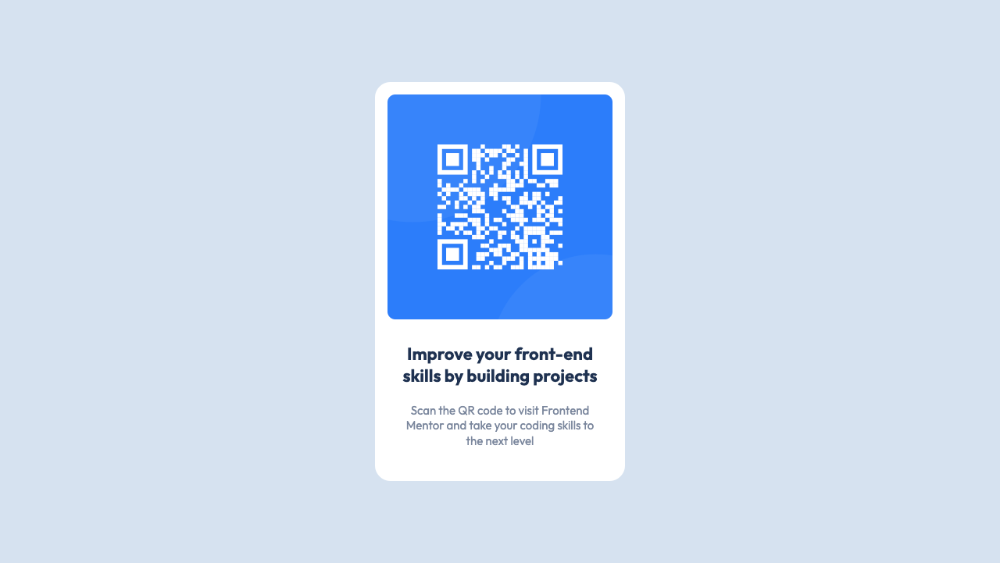
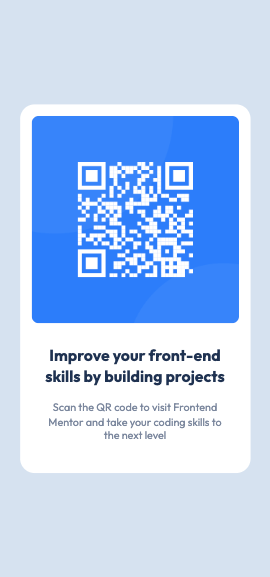

# Frontend Mentor - QR code component solution

This is a solution to the [QR code component challenge on Frontend Mentor](https://www.frontendmentor.io/challenges/qr-code-component-iux_sIO_H). Frontend Mentor challenges help you improve your coding skills by building realistic projects. 

## Table of contents

- [Overview](#overview)
  - [Screenshot](#screenshot)
  - [Links](#links)
- [My process](#my-process)
  - [Built with](#built-with)
  - [What I learned](#what-i-learned)
  - [Continued development](#continued-development)
  - [Useful resources](#useful-resources)
- [Author](#author)
- [Acknowledgments](#acknowledgments)

## Overview
- A webpage that shows a QR code and a description of the content it holds.

### Screenshot

### Links

- Solution URL: [Add solution URL here](https://your-solution-url.com)
- Live Site URL: [Add live site URL here](https://your-live-site-url.com)

## My process
- setting up the work directory
- setting up all the necessary folders and files within
- analyzing the previews in desktop and mobile and figuring out DOM elements to use
- creating the html markup with all the necessary DOM elements
- styling
    -> Reading the style-guide.md file to capture the properties
    -> Using AdobeXD to capture the various component properties such as width, height
       padding, margins etc that are not shown on the style-guide.md file
    -> creating variables
    -> creating helper classes and global css rules
    -> creating main css rules depending on how many sections I have.

### Built with

- Semantic HTML5 markup
- SCSS custom properties
- Flexbox
- Desktop first workflow

### What I learned

- I learned that there's a font family called 'outfit'
- Since there was no change on both mobile and desktop views on the DOM elements, I 
  never saw the need to create media queries

### Continued development
- I would like to focus more on media queries as they give me the chills everytime.

### Useful resources

- [Example resource 1](https://www.inmotionhosting.com/support/website/git/connect-local-project-to-github/) - This helped me recap on how to create and push local files to a github repository.
- [Example resource 2](https://www.example.com) - This is an amazing article which helped me finally understand XYZ. I'd recommend it to anyone still learning this concept.

## Author

- Name - [Eric Wainaina]
- Frontend Mentor - [@vladmia](https://www.frontendmentor.io/profile/vladmia)
- Twitter - [@ftahtahteetah](https://www.twitter.com/ftahtahteetah)

## Acknowledgments

- I give credits to Jessica Chan(check out her youtube channel) who is one of my 
  favorite mentors in the web development track. I find her solutions to different problems that a web developer experiences while developing, very helpful. Her approach to setting up at the beginning and moving through a project very ideal. I
  actually adopted her way of setting up a project and even shifted from css to scss 
  as she made me see how easy it was to use it.
